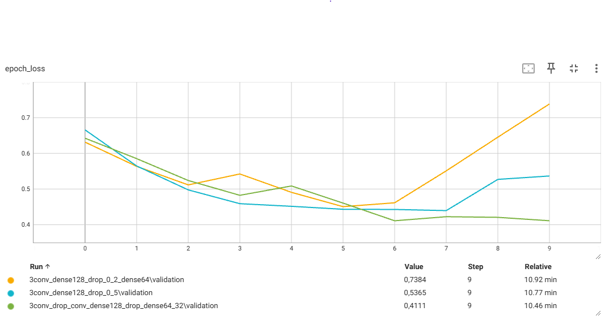

# Projekt: Klasyfikacja Obrazów (Kot vs Pies)

## Opis Projektu

Jest to projekt zaliczeniowy z modułu uczenia maszynowego, którego celem jest stworzenie i wytrenowanie modelu klasyfikującego zdjęcia na dwie kategorie: **kot** lub **pies**.  
Model został zaimplementowany w języku Python z wykorzystaniem biblioteki **TensorFlow** (Keras) do uczenia głębokich sieci neuronowych. Dodatkowo korzystamy z bibliotek **scikit-learn** (m.in. do podziału danych i obliczania wag klas), **matplotlib** oraz **seaborn** (do wizualizacji), a także **unittest** (do testów jednostkowych).

Wewnątrz wykorzystujemy klasyczny konwolucyjny model sieci neuronowej (CNN) z kilkoma warstwami **Conv2D**, **MaxPooling2D**, warstwą **Flatten** oraz warstwami gęstymi (**Dense**). Całość kończymy jednowymiarową warstwą wyjściową z funkcją aktywacji **sigmoid**, aby rozróżniać dwie klasy (kot/pies).

---

## Struktura Kodu

Projekt został podzielony na kilka klas, z których każda odpowiada za inny element procesu przetwarzania, uczenia i predykcji:

1. **Config**  
   - Przechowuje ustawienia konfiguracyjne: ścieżki do danych, parametry treningu (liczba epok, rozmiar batcha, współczynnik uczenia, itp.), a także ścieżkę do zapisu wytrenowanego modelu i ścieżkę do logów TensorBoard.

2. **DataProcessor**  
   - Odpowiada za ładowanie danych z folderów („Cat” i „Dog”) oraz za podział zbioru danych na treningowy i testowy.  
   - Normalizuje obrazy, tak aby wartości pikseli były w zakresie \[0, 1\].  
   - Zawiera funkcje analizy danych (np. wyświetlenie podstawowych statystyk lub histogramu wartości pikseli).

3. **FeatureEngineer**  
   - Zajmuje się inżynierią cech. W naszym przypadku oznacza to przygotowanie generatora danych (**ImageDataGenerator**) i wykonywanie augmentacji obrazów (przesunięcia, obroty, odbicia, zoom itp.), co pozwala na sztuczne powiększenie zbioru treningowego i zwiększenie ogólnej skuteczności modelu.

4. **ModelTrainer**  
   - Buduje architekturę sieci neuronowej (model sekwencyjny **Sequential** z warstwami konwolucyjnymi, poolingiem i kilkoma warstwami gęstymi).  
   - Kompiluje model z optymalizatorem **Adam** i funkcją straty **binary_crossentropy** (odpowiednią do problemu binarnej klasyfikacji).  
   - Przeprowadza trening modelu na danych treningowych, uwzględniając walidację, zapisywanie najlepszego modelu oraz logowanie danych w TensorBoard.  
   - Udostępnia funkcję do oceny wydajności modelu na zbiorze testowym.  
   - Oferuje również mechanizm do fine-tuningu modelu (dalszego dostrajania).

5. **App**  
   - Klasa główna, która spina wszystkie powyższe elementy w pełen pipeline aplikacji:  
     1. Wczytuje dane i dzieli je na zbiory (treningowy i testowy).  
     2. Wykonuje podstawową analizę danych (np. histogram wartości pikseli).  
     3. Przeprowadza augmentację danych treningowych.  
     4. Buduje i trenuje model, a następnie dokonuje jego fine-tuningu.  
     5. Ocenia model na zbiorze testowym i wyświetla wyniki (m.in. macierz pomyłek, raport klasyfikacji).  

6. **ModelPrediction**  
   - Klasa pomocnicza, która ładuje wytrenowany model z pliku `.keras`.  
   - Odpowiada za wczytanie pojedynczego obrazu, przetworzenie go (zmiana rozmiaru, normalizacja) i wykonanie predykcji (z określeniem prawdopodobieństwa klasy „Dog” lub „Cat”).

---

## Kroki Działania Programu

1. **Sprawdzenie ścieżki do danych**  
   Program najpierw weryfikuje, czy folder z danymi (`PetImages`) istnieje i zawiera podfoldery `Cat` i `Dog`.

2. **Wczytanie i podział danych**  
   - Wczytywane są wszystkie obrazy z folderów `Cat` i `Dog`.  
   - Obrazy są skalowane do rozmiaru 128×128 i normalizowane.  
   - Następuje podział na zbiór treningowy i testowy (np. w proporcji 80% / 20%).

3. **Analiza wczytanych danych**  
   - Wyświetlane są podstawowe statystyki (liczba próbek, rozkład etykiet, średnia i odchylenie standardowe wartości pikseli, histogram).

4. **Augmentacja danych**  
   - Dane treningowe przechodzą przez generator augmentujący (przesunięcia, obroty, zmiany zoomu i inne przekształcenia).  
   - Dzięki temu uzyskujemy dodatkowe próbki, co pomaga uniknąć przeuczenia modelu.

5. **Budowa i kompilacja modelu**  
   - Tworzony jest **Sequential** z kilkoma warstwami konwolucyjnymi i warstwami pooling, a następnie warstwy gęste (z warstwą Dropout w celu regularizacji).  
   - Ostatnia warstwa jest jednowymiarowa (**Dense(1)**) z aktywacją **sigmoid**, co pozwala rozróżniać dwie klasy (kot / pies).

6. **Trening modelu**  
   - Model trenuje się na zbiorze treningowym (z augmentacją lub bez, w zależności od ustawień).  
   - Obserwujemy w czasie treningu dokładność (accuracy) i funkcję straty (loss) zarówno dla zbioru treningowego, jak i walidacyjnego.  
   - Najlepszy model (z najwyższą dokładnością na zbiorze walidacyjnym) jest zapisywany do pliku `.keras`.  
   - Logi są zapisywane w folderze `logs`, tak aby można je było przeglądać np. w TensorBoard.

7. **Fine-tuning modelu**  
   - Możemy odblokować warstwy i dalej dostrajać model z mniejszym współczynnikiem uczenia, co nieraz poprawia jego wyniki.

8. **Ewaluacja modelu**  
   - Na zbiorze testowym mierzymy ostateczną dokładność oraz stratę.  
   - Wyświetlana jest macierz pomyłek i raport klasyfikacji (precision, recall, f1-score), by ocenić dokładniej wyniki dla obu klas (kot / pies).

9. **Predykcja nowego obrazu** (opcja)  
   - Po wytrenowaniu i zapisaniu modelu można go załadować i przetestować na nowym obrazie, który nie był wcześniej w zbiorze.  
   - Model zwraca etykietę „Dog” lub „Cat” wraz z wyliczonym prawdopodobieństwem.

---

## Wymagane Biblioteki

- `tensorflow wersja: 2.18.0` (preferowana wersja 2.x)
- `numpy wersja: 1.26.4`
- `matplotlib wersja: 3.8.4`
- `seaborn wersja: 0.13.2`
- `scikit-learn wersja: 1.4.2`
- `unittest`
---

## Testy różnych kombinacji warstw przeprowadzone w Tensorboard



Zapisaliśmy logi kilku wytrenowanych modeli w Tensorboard i kierując się wartością Loss wybraliśmy model z następującymi warstwami:

```python
Input(shape=(*self.config.image_size, 3)),  # Input layer
Conv2D(32, (3, 3), activation='relu'),
MaxPooling2D(2, 2),
Conv2D(64, (3, 3), activation='relu'),
MaxPooling2D(2, 2),
Conv2D(128, (3, 3), activation='relu'),
MaxPooling2D(2, 2),
Dropout(0.3),
Conv2D(128, (3, 3), activation='relu'),
MaxPooling2D(2, 2),
Flatten(),
Dense(128, activation='relu'),
Dropout(0.3),
Dense(64, activation='relu'),
Dense(32, activation='relu'),
Dense(1, activation='sigmoid')
```
